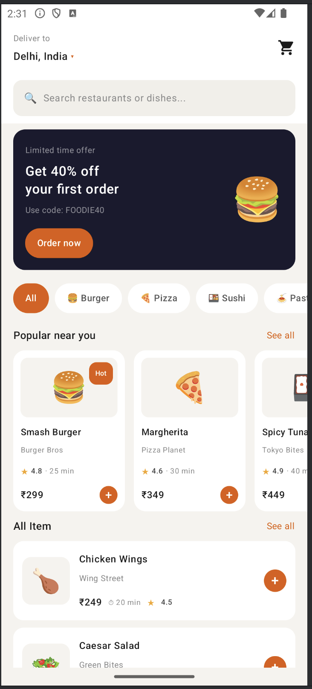
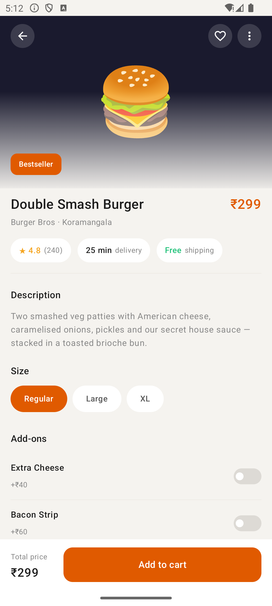
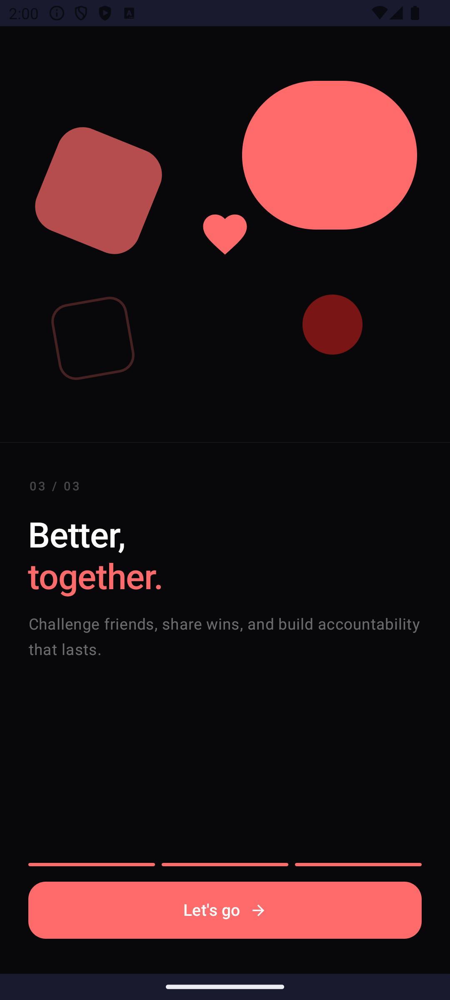

# Jetpack Compose Practice 🚀

Daily Compose screen implementations — production grade UI practice.

---

## Day 01 — Food Home Screen

**Concepts covered:**
- Nested `LazyColumn` + `LazyRow`
- `Scaffold` with custom TopBar
- `BadgedBox` for cart count
- `statusBarsPadding` for edge-to-edge
- State hoisting pattern
- Modifier chain order

---

## Day 02 — Product Detail Screen

**Concepts covered:**
- Collapsing hero with `derivedStateOf` + `rememberScrollState`
- `Column + verticalScroll` vs `LazyColumn`
- `ModalBottomSheet` with `skipPartiallyExpanded`
- `mutableStateListOf` for reactive list state
- Fixed button overlay outside collapsing Box
- `navigationBarsPadding` + `statusBarsPadding`
- `coerceIn` for safe value clamping

## Day 03 — Onboarding Screen

**Concepts covered:**
- `HorizontalPager` + `rememberPagerState`
- `animateColorAsState` — button & progress bar color per slide
- `buildAnnotatedString` + `SpanStyle` — inline colored text
- `animateScrollToPage` — programmatic pager navigation
- Custom segmented progress bar
- `MutableInteractionSource` + `indication = null` — ripple-free tap
- `derivedStateOf` — recomposition optimization
- `systemBarsPadding` — safe area handling
- Geometric art with `Box` + `clip` + `rotate` + `offset`